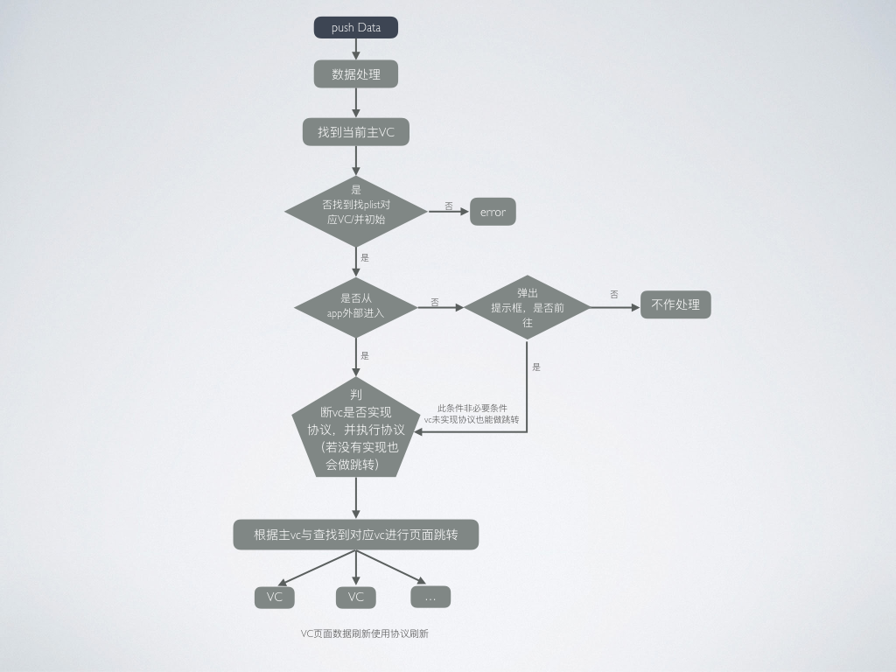

# SJPushFlow


## How To Use
```swift
Swift:

SJPushDataOperation.registerApp(plistName: "PropertyList", pushData: dictionary as NSDictionary, isPushWeakApp: false)


use protocol

class ViewController : UIViewController,SJPushDataVCProtocol{    
override func viewDidLoad() {
}

func upData(pushData: NSDictionary){
print(pushData)   
}
}
```

## Installation with CocoaPods
```
platform :ios, '8.0'
use_frameworks!
pod 'SJPushFlow', '~>1.0.2'
```
## Architecture
<p align="center" >

</p>
